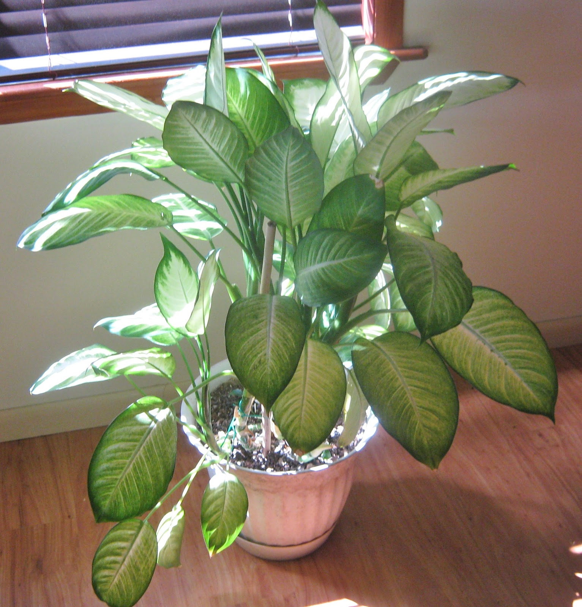
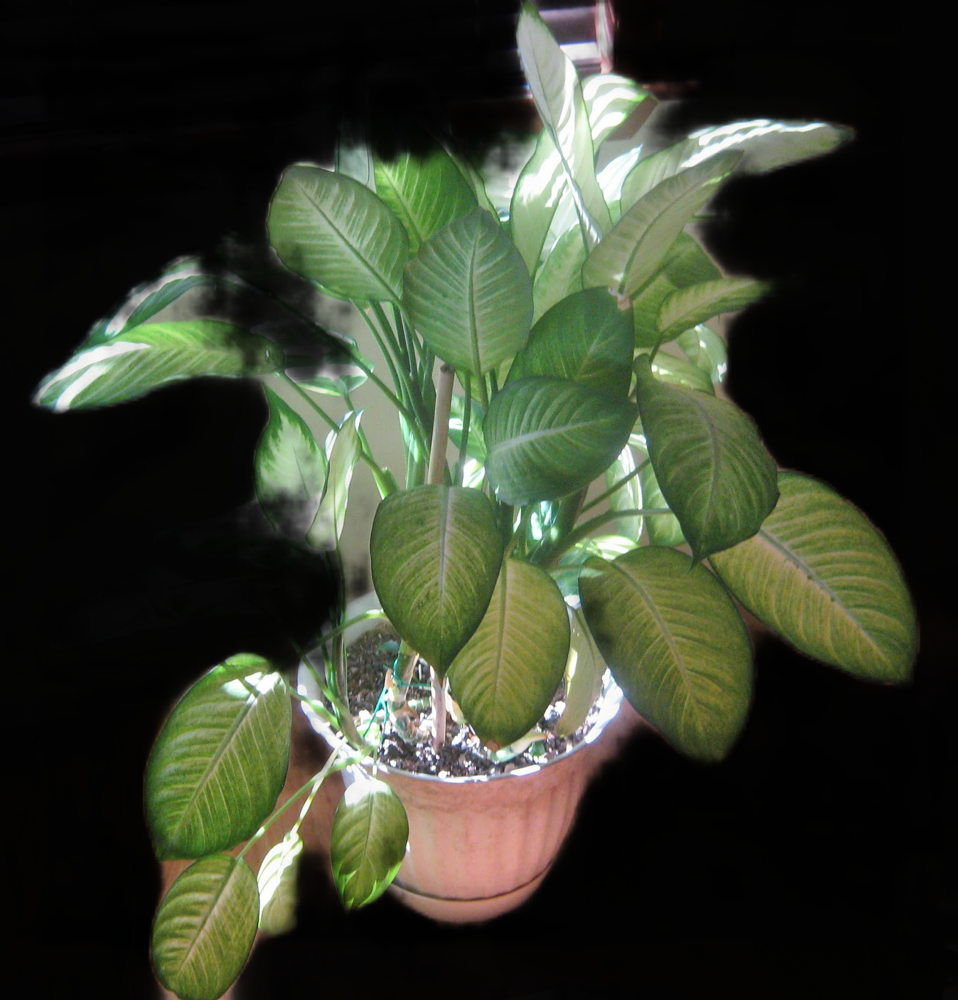
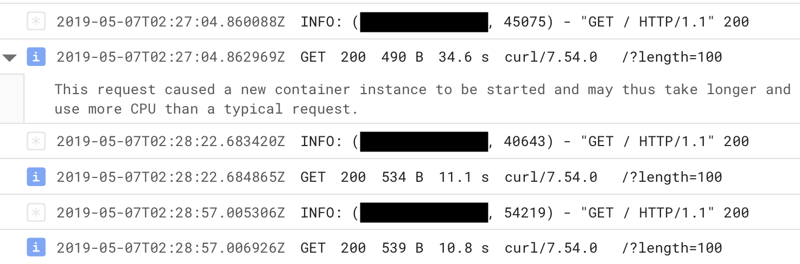

# Fabricating Alternatives - Outliner API

This is an app for generating a masked cutout of the most salient object in a image. Build on the work of [Ge Zheng](https://github.com/Joker316701882/Salient-Object-Detection)

The API was build to take a DataURL base64 string as a post request and returns the masked image in the same format. 

The code can easily be shipped to Google Cloud Run or other Docker container service.

## Demo


| [](http://videoblocks.com)  | [](http://audioblocks.com) |  |
|:---:|:---:|:---:|
|||  |


## Setup Project
<h3> Download Pretrained Model </h3>
https://drive.google.com/open?id=0B6l9O8aWij8fUGtVNldUTXA4eHc

1. Download pretrained model and put them under folder "salience_model" ,(need to create folder yourself)<br />


## How to Build the Container And Start Cloud Run

Since Cloud Run is stateless without access to local storage, you must bundle the model within the container. First, download/clone this repo and copy the model into the folder (the model should be in the form of the folder hierarchy `/checkpoint/run1`, which is the case by default for most finetuning scripts)

Then build the image:

```shell
docker build . -t outliner
```

If you want to test the image locally with the same specs as Cloud Run, you can run:

```shell
docker run -p 8080:8080 --memory="2g" --cpus="1" outliner
```

You can then visit/`curl` http://0.0.0.0:8080 to get generated text!

Then, tag the image and upload it to the Google [Container Registry](https://console.cloud.google.com/kubernetes/images/list) (note, this will take awhile due to the image size!):

```shell
docker tag outliner gcr.io/[PROJECT-ID]/outliner
docker push gcr.io/[PROJECT-ID]/outliner
```

Once done, deploy the uploaded image to Cloud Run via [the console](https://console.cloud.google.com/run). **Set Memory Allocated to 2 GB and Maximum Requests Per Container to 1**!

The Cloud Run logs will tell you how the service runs, and the `INFO` log level contains Cloud Run diagnostic info, including the time it takes for a request to run.



## Interacting with the API in Cloud Run

## License

MIT

## Disclaimer

This repo has no affiliation or relationship with OpenAI.
